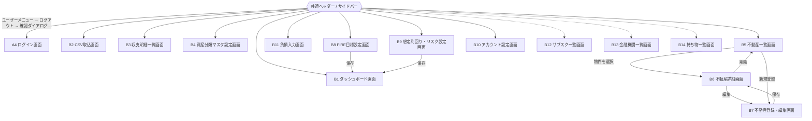
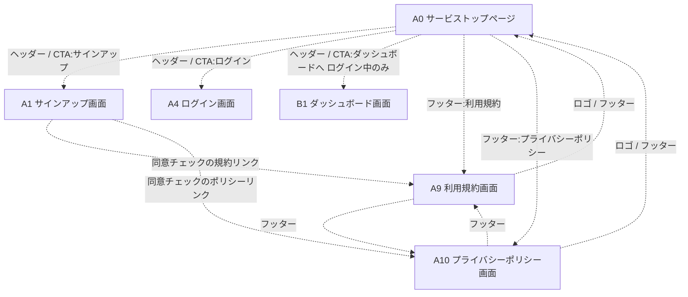

# 画面一覧・画面遷移図

## 1. 位置付け

本ドキュメントは [FIRE-FIRE 要件定義書](./fire-asset-management-requirements.md) および [ログイン画面・認証機能 要件定義書](./auth-login-requirements.md) をもとに、画面一覧と画面遷移図を整理したものである。

対象スコープは **Phase 1〜7** とする。**Phase X(マネーフォワード定期自動取得、SaaS化)に関連する画面は対象外**とし、別途検討する(要件定義書 7.2)。

フェーズごとに、本ドキュメントが書く深さが違う。

| フェーズ | 画面 | 本ドキュメントでの扱い |
|---|---|---|
| Phase 1〜4 | A1〜A8、B1〜B11 | 実装済み。画面ごとの詳細要件を `screen-requirements-*.md` に持つ |
| Phase 5 | B12〜B14(2.7) | 未実装。詳細要件を [screen-requirements-lists.md](./screen-requirements-lists.md) に持つ |
| Phase 6〜7 | B15〜B17(2.8) | 未実装。**何を作るかまで**を書き、詳細要件は着手時に作る。外部の仕様(証券会社のCSV、マイナポータルAPI)を確かめないと決められない項目が多いため |
| (フェーズ外) | A0・A9・A10(2.0) | 未実装。詳細要件を [screen-requirements-public.md](./screen-requirements-public.md) に持つ。フェーズの段に乗らない理由は [要件定義書 7.3](./fire-asset-management-requirements.md#73-サービスの公開面をフェーズ順に乗せない理由) |

アプリ全体は、ログイン後は共通ヘッダー/サイドバーから各主要画面へ自由に遷移できる「ダッシュボードアプリ型」のナビゲーション構造を想定する。

## 2. 画面一覧

### 2.0 公開画面(未実装)

各画面の詳細要件は [screen-requirements-public.md](./screen-requirements-public.md) を参照。

| 画面ID | 画面名 | 概要 | 関連要件 |
|---|---|---|---|
| A0 | サービストップページ | 未ログインの訪問者に本サービスの内容を伝えるランディングページ。ヘッダーからA1・A4へ送り出し、フッターからA9・A10へ導く。**ベータ版であることを明記する** | 要件定義書 4.15 |
| A9 | 利用規約画面 | 利用条件の掲示。A0のフッターとA1の同意チェックからリンクする | 要件定義書 4.15 |
| A10 | プライバシーポリシー画面 | 取得する情報とその扱いの掲示。リンク元はA9と同じ | 要件定義書 4.15 |

**A1〜A8と分けてあるのは、認証フローに属さないためである。** A1〜A8も未ログインで到達するが、あちらは「アカウントを作る/ログインする」手順の途中にあり、行き着く先はB1である。この3画面はどのフローにも属さず、訪問者はそのまま帰ってよい。ログイン中に開いてもB1へリダイレクトしない点も、A1〜A8(ログイン済みならガードで送り出される)と違う。

**節番号を2.0にしたのは、既存の節番号を動かさないためである**(3.0の描き分けの節と同じ扱い)。2.1〜2.8は本ドキュメントの他の箇所・[DESIGN.md](../DESIGN.md)・HTMLモック・各スキルから参照されており、A1〜A8の前に置くために振り直すと参照が総崩れになる。並びの意図として「A0が先頭」であることは、節の位置(2.1の前)が表している。

**A9・A10の画面IDが末尾の番号になっているのは、後から追加された経緯によるものである**(2.2のB11と同じ)。位置付けはA0と同じ公開画面であり、A8の次に続く認証画面ではない。

### 2.1 認証系画面

[auth-login-requirements.md](./auth-login-requirements.md) 4章に準拠。各画面の詳細要件は [screen-requirements-auth.md](./screen-requirements-auth.md) を参照。

| 画面ID | 画面名 | 概要 |
|---|---|---|
| A1 | サインアップ画面 | メールアドレス・パスワード入力。パスワードポリシーをリアルタイムでバリデーション表示 |
| A2 | メールアドレス確認待ち画面 | サインアップ直後に表示。確認メール再送導線を含む |
| A3 | 2FA登録画面 | メール確認後に強制表示。QRコード表示、認証アプリの確認コード入力、リカバリーコードの発行・表示 |
| A4 | ログイン画面 | メールアドレス・パスワード入力、「パスワードをお忘れの方」導線 |
| A5 | 2FA検証画面 | 一次認証成功後に表示。認証アプリの確認コード入力、リカバリーコードへの切り替え |
| A6 | パスワードをお忘れの方画面 | メールアドレス入力、リセットメール送信 |
| A7 | パスワード再設定画面 | リセットメールのリンクから遷移。新パスワード入力 |
| A8 | アカウント連携画面 | 既存のパスワードアカウントと同一メールアドレスでGoogleログインした場合に表示。パスワードによる本人確認を経てGoogleアカウントを連携 |

Googleによるソーシャルログイン([auth-login-requirements.md](./auth-login-requirements.md) 3.8)の開始導線は、A1・A4に「Googleで続ける」ボタンとして追加する(新規画面は設けない)。Googleログイン後も2FAは必須のため、A3・A5はメール/パスワード経由と共通の画面を通る。

Firebaseが送るメール(パスワード再設定・メールアドレス確認)のリンク先は、プロジェクトに1つしか設定できない共通のアクションURL(`/auth/action`)となる。ここは `mode` に応じてA7へ引き渡すか、メールアドレスの確認を適用して結果だけを表示する受け口であり、独立した画面IDは設けない(設定手順は [ci-cd-setup.md](./ci-cd-setup.md) 12章)。

### 2.2 ダッシュボード・データ管理系画面

各画面の詳細要件は [screen-requirements-dashboard.md](./screen-requirements-dashboard.md) を参照。

| 画面ID | 画面名 | 概要 | 関連要件 |
|---|---|---|---|
| B1 | ダッシュボード画面 | 資産推移グラフ(資産種別の積み上げ。負債の反映を切替)、分類別内訳(円グラフ)、FIRE達成度ゲージ/到達予測日、収支サマリ(選択した年月の収支・費目別支出の円グラフ)、負債サマリを表示するトップ画面。資産推移グラフと分類別内訳は分類軸の切り替えに対応。収支サマリは分類軸・表示期間ではなくカード内の年月選択に従う(既定は当月)。FIRE達成度の現在資産額もB8で設定した分類軸で集計するが、こちらは画面上の切り替えには追従しない | 要件定義書 4.3 / 4.4 / 4.8 |
| B2 | CSV取込画面 | マネーフォワードCSV(資産残高推移/入出金明細)のアップロード。取込種別をタブ等で切り替え | 要件定義書 4.2 / [入出金明細CSV取込](./transaction-import-requirements.md) |
| B3 | 収支明細一覧画面 | 入出金明細CSVから取り込んだ個々の取引データを一覧・検索する画面 | 要件定義書 4.2 / 4.4 / [入出金明細CSV取込](./transaction-import-requirements.md) |
| B4 | 資産分類マスタ設定画面 | 資産分類軸(総資産・純金融資産・投資性資産等)をユーザーが追加・編集できる設定画面。集計対象には資産種別に加えて、B5〜B7で登録した物件(利ざや または 時価)とB11で登録した負債も選べる | 要件定義書 4.3 |
| B11 | 負債入力画面 | 住宅ローン・カードローン等の負債を項目ごとに手動で登録・編集・削除する画面。1画面の中でフォームを増減させ、まとめて保存する | 要件定義書 4.8 |

B11をこの節に置くのは、負債がB4の集計対象・B1の表示対象として資産データと同じ経路に乗るためである。画面IDが連番の末尾になっているのは後から追加された経緯によるもので、位置付けはB2〜B4と同じ「ダッシュボードに供給するデータを管理する画面」。

ただし**サイドバーの並びはB5 不動産一覧の次**とする(3.3)。節の分類はデータの経路で決めるが、サイドバーの並びは操作の性質で決めており、手動で登録・更新する画面(B5・B11)を隣り合わせるほうが探しやすいため。CSV取込を起点とするB2〜B4の並びも崩さずに済む。

### 2.3 不動産管理系画面

各画面の詳細要件は [screen-requirements-real-estate.md](./screen-requirements-real-estate.md) を参照。

| 画面ID | 画面名 | 概要 | 関連要件 |
|---|---|---|---|
| B5 | 不動産一覧画面 | 登録済み物件の一覧表示 | 要件定義書 4.5 |
| B6 | 不動産詳細画面 | 物件基本情報、時価、ローン残高、賃貸収入/支出、利ざや(時価-ローン残高)の自動計算結果を表示 | 要件定義書 4.5 |
| B7 | 不動産登録・編集画面 | 物件基本情報・時価・ローン残高・賃貸収入/支出の登録・編集フォーム | 要件定義書 4.5 |

### 2.4 FIRE目標・シミュレーション設定系画面

各画面の詳細要件は [screen-requirements-fire-goal.md](./screen-requirements-fire-goal.md) を参照。

| 画面ID | 画面名 | 概要 | 関連要件 |
|---|---|---|---|
| B8 | FIRE目標設定画面 | 目標資産額の直接設定、または年間支出額からの逆算(4%ルール等)を切り替えて設定。達成度の判定に使う資産分類(既定は総資産)と、到達予測に使う毎月の積立額もここで設定する | 要件定義書 4.6 |
| B9 | 想定利回り・リスク設定画面 | **資産種別ごと**の想定利回り(年率)・リスクレベルを手動設定。到達予測の入力とB1のリスク可視化の両方に反映(不動産時価はB7で設定する) | 要件定義書 4.7 |

### 2.5 アカウント系画面

各画面の詳細要件は [screen-requirements-account.md](./screen-requirements-account.md) を参照。

| 画面ID | 画面名 | 概要 | 関連要件 |
|---|---|---|---|
| B10 | アカウント設定画面 | パスワード変更、2FA再設定など、ログイン後のアカウント関連設定を行う画面 | auth-login-requirements.md 3章 |

### 2.6 画面IDを持たない共通操作

画面ではなく、複数の画面に共通して置かれる操作。独立した画面IDは設けない。

| 操作 | 設置場所 | 概要 | 関連要件 |
|---|---|---|---|
| ログアウト | ログイン後(B1〜B11)の共通ヘッダーのユーザーメニュー、およびA2・A3 | 確認ダイアログを挟んでセッションを破棄し、**A4 ログイン画面** へ戻す。A2・A3にも置くのは、サインイン済みだが手順が未完了の状態から抜け出す手段が他に無いため | auth-login-requirements.md 3.9 |

ログアウト後の遷移先はA4で、A4側に「ログアウトしました」の表示を出す。ログアウト完了専用の画面は設けない。詳細は [screen-requirements-account.md](./screen-requirements-account.md) 2章(ユーザーメニューと確認ダイアログ)および [screen-requirements-auth.md](./screen-requirements-auth.md)(A2・A3の離脱導線、A4の表示)を参照。

### 2.7 リスト管理系画面(Phase 5・未実装)

各画面の詳細要件は [screen-requirements-lists.md](./screen-requirements-lists.md) を参照。

| 画面ID | 画面名 | 概要 | 関連要件 |
|---|---|---|---|
| B12 | サブスク一覧画面 | 定期課金しているサービスを手動で登録し、月額換算・年額換算の合計を表示する。1画面の中でフォームを増減させ、まとめて保存する(B11と同じ形) | 要件定義書 4.9 |
| B13 | 金融機関一覧画面 | 保有している口座・金融機関の一覧。入出金明細CSVの `保有金融機関` 列から登録され、手動での追加もできる。**行ごとに保存し、削除できるのは手動追加の行だけ**(CSV由来の行は次の取込で復活するため) | 要件定義書 4.10 |
| B14 | 持ち物一覧画面 | 自動車・PC・スマホなど、資産として計上しない持ち物を手動で登録する。B12と同じ形 | 要件定義書 4.11 |

**3画面に共通するのは「ダッシュボードの集計に効かない」ことである**(要件定義書 4.9〜4.11)。B2〜B4・B5〜B7・B11がいずれもB1へ数字を供給する画面であるのに対し、この3画面は自分の中で完結する。**節を分けてあるのはこの性質のためで**、2.2の「ダッシュボードに供給するデータを管理する画面」に混ぜると、B1の数字が変わらない理由が読み取れなくなる。

節番号が2.6の共通操作より後になっているのは、既存の節番号を動かさないためである(2.6は本ドキュメントの他の箇所・[DESIGN.md](../DESIGN.md)・HTMLモックから参照されている)。並びの意図ではない。

### 2.8 Phase 6・7 で追加を予定している画面(未実装・詳細未確定)

**画面IDだけを先に確保し、詳細要件は着手時に作る。** いずれも外部の仕様に依存しており、確かめる前に表示項目や遷移条件を書くと着手時に書き直しになるため(要件定義書 7.1)。

| 画面ID | 画面名 | 何を作るか | 関連要件 |
|---|---|---|---|
| B15 | 証券口座画面 | SBI証券の投資信託口座のCSVを取り込み、保有ファンドごとの評価額・取得額・評価損益と、口座区分別の合計を表示する | 要件定義書 4.12(Phase 6) |
| B16 | 積立・取り崩しシミュレーション画面 | 現在の資産額・積立額・想定利回りを初期値に、積立局面と取り崩し局面の資産推移を試算する。B1の到達予測日は置き換えない | 要件定義書 4.13(Phase 6) |
| B17 | マイナポータル連携画面 | マイナポータルAPIから税・社会保険・年金のデータを取得する。**調査の結果、実現しない可能性がある** | 要件定義書 4.14(Phase 7) |

- **B15の取込がB2のタブとして入るか、B15が独自に持つかは未確定。** マネーフォワードのCSVとは提供元も列構成も違うため、B2の「取込種別を切り替えるタブ」に並べるのが自然かどうかを、CSVの実物を見てから決める
- **B16をFIRE目標・シミュレーション設定系(2.4)に入れるかも未確定。** 節の名前は既に「シミュレーション設定系」だが、B8・B9が設定を保存する画面であるのに対しB16は試算する画面で、性質が違う

## 3. 画面遷移図

### 3.0 遷移の描き分け

**未実装の遷移は Mermaid の破線(`-.->`)で描く。** 実装済みの遷移は実線(`-->`)である。

要件が先に固まった遷移を図へ載せることがあり、そのとき実線で描くと図だけを見た人には実装済みと区別が付かない。図の下に注記を置く運用も併用するが、注記は矢印から離れており、遷移が増えるほど「どの1本のことか」が読み取りにくくなる。

- **実装が入ったら実線に戻す。** 破線のまま残すと、今度は実装済みのものが未実装に見える
- ラベルに `(未実装)` と書き添える形は採らない。未実装の遷移が複数になったときに図が文字で混み合い、`(自動)` のような**遷移の性質**を表すラベルと混ざるため
- **現在の破線は、共通ヘッダー/サイドバーから B12〜B14(2.7)への3本と、公開画面 A0・A9・A10(2.0)に出入りする分(3.1・3.4)である。** どちらもまだ実装されていない。この規約は[B6-2](https://trello.com/c/amf5APQu)で先に決めたもので、当時は適用先が無く規約だけが残っていた

**B15〜B17(2.8)は図に載せない。** 画面IDを確保しただけで、サイドバーに並べるのか別の画面の中に入るのかまで決まっていない(2.8)。決まっていない遷移を破線で描くと、「実装されていないだけで行き先は決まっている」B12〜B14と区別が付かなくなる。

### 3.1 認証フロー

```mermaid
flowchart TD
    Start([未ログイン]) --> Login[A4 ログイン画面]
    Start --> Signup[A1 サインアップ画面]
    Start -.-> Top[A0 サービストップページ]
    Top -.->|ログイン| Login
    Top -.->|サインアップ| Signup

    Signup --> VerifyWait[A2 メールアドレス確認待ち画面]
    VerifyWait -->|メール内リンクで確認完了| MFASetup[A3 2FA登録画面]
    VerifyWait -->|セッション無し / やり直し| Signup
    VerifyWait -->|ログアウト 別のアカウントでログイン| Login
    MFASetup -->|確認コード検証成功| Dashboard[B1 ダッシュボード画面]
    MFASetup -->|ログアウト 別のアカウントでログイン| Login

    Login -->|ID/PW認証成功(2FA登録済み)| MFAVerify[A5 2FA検証画面]
    MFAVerify -->|確認コード検証成功| Dashboard
    MFAVerify -->|リカバリーコード検証成功(TOTP解除 → ログインやり直し)| MFASetup
    MFAVerify -->|検証セッション無し(自動)| Login
    MFAVerify -->|検証セッション期限切れ(ログイン画面へ)| Login
    MFAVerify -->|リカバリーコード検証後のログインやり直し失敗(ログイン画面へ)| Login
    Login -->|ID/PW認証成功(メール未確認)| VerifyWait
    Login -->|ID/PW認証成功(2FA未登録)| MFASetup
    Login -->|パスワードを忘れた| Forgot[A6 パスワードをお忘れの方画面]
    Login -->|アカウントをお持ちでない方| Signup
    Forgot -->|メール内リンクで再設定へ| ResetPw[A7 パスワード再設定画面]
    ResetPw -->|再設定完了(完了メッセージ表示後)| Login
    ResetPw -->|リンクが無効・期限切れ| Forgot
```

> **A0からの2本は破線である**(3.0)。A0は未実装で、現在の `/` は開発環境確認用のプレースホルダーが応答している([screen-requirements-public.md](./screen-requirements-public.md) 1章)。A0を経由せず直接A1・A4を開く経路(`Start` からの実線2本)は実装済みで、A0が入っても無くならない — ブックマークやログアウト後の遷移先はA4のままである。
>
> **A0へ戻る矢印は認証系のどの画面からも引いていない。** A1・A4からトップへ戻る導線は設けず(認証の途中で公開ページへ引き返す用はない)、ブラウザの戻る操作に委ねる。A0側からの片道である。
>
> A2・A3の**ログアウト**はサインイン済みの状態を破棄してA4へ戻す導線で、2.6の共通操作と同じものである。A2の「セッション無し / やり直し」がA1へ向かうのに対しこちらがA4へ向かうのは、前者が同じアカウントでサインアップをやり直す導線、後者が**別のアカウントでログインし直す**導線だからである。A5・A8にログアウトが無いのは、その段階ではまだサインインが成立しておらず、既存の「ログイン画面へ」「連携せずにログインへ戻る」導線が離脱手段になっているため。

### 3.2 ソーシャルログイン(Google)フロー

3.1のA1・A4に追加する「Googleで続ける」導線から分岐する部分のみを抜き出したもの。合流先(A3 / A5 / B1)は3.1と同一の画面である。

```mermaid
flowchart TD
    Signup[A1 サインアップ画面] -->|Googleで続ける| Google{{Googleログイン ポップアップ}}
    Login[A4 ログイン画面] -->|Googleで続ける| Google

    Google -->|ポップアップを閉じた / キャンセル(自動)| Back[元の画面に留まる]
    Google -->|新規作成 メールはGoogle側で確認済み(自動)| MFASetup[A3 2FA登録画面]
    Google -->|既存Googleアカウント・2FA未登録(自動)| MFASetup
    Google -->|既存Googleアカウント・2FA登録済み(自動)| MFAVerify[A5 2FA検証画面]
    Google -->|同一メールのパスワードアカウントが既存(自動)| LinkAccount[A8 アカウント連携画面]

    LinkAccount -->|パスワード検証成功・2FA登録済み(自動)| MFAVerify
    LinkAccount -->|パスワード検証成功・2FA未登録・連携後メール確認済み(自動)| MFASetup
    LinkAccount -->|パスワード検証成功・2FA未登録・連携後もメール未確認(自動)| VerifyWait[A2 メールアドレス確認待ち画面]
    LinkAccount -->|連携せずにログインへ戻る| Login
    LinkAccount -->|連携セッション無し(自動)| Login

    VerifyWait -->|メール内リンクで確認完了| MFASetup
    MFASetup -->|確認コード検証成功| Dashboard[B1 ダッシュボード画面]
    MFAVerify -->|確認コード検証成功| Dashboard
```

> Googleアカウントの連携は、2FAの検証まで完了してサインインが成立した時点で実行する(2FA登録済みユーザーはパスワード検証だけではサインインが完了しないため)。
>
> ラベルの `(自動)` は3.1と同じく「ユーザーの操作を挟まずに遷移する」ことを指し、認証結果による分岐(パスワード検証成功後の2FA状況による振り分け)と、前提が満たされていない場合のガード(連携セッション無し)の両方に付く。
>
> A8の「2FA未登録・メール未確認」はA2へ戻る分岐で、A4が「メール未確認」を「2FA未登録」より優先するのと揃えている。**この2本の振り分けは連携の実行後に `emailVerified` を取り直して決める** — 連携するGoogleアカウントのメールアドレスはGoogle側で確認済みのため、連携によってtrueに変わりうるため([screen-requirements-auth.md](./screen-requirements-auth.md) A8)。
>
> このうち**A8からA4へ戻す**ガードは「連携セッション無し」の1本だけである。A5の「検証セッション期限切れ」に相当する導線はA8には無い — Google資格情報の期限切れは連携の実行時、つまり**サインインが成立した後**に判明するため、A8やA4へ戻さずB1の「Googleアカウント連携の失敗通知」で扱う(下記 [screen-requirements-dashboard.md](./screen-requirements-dashboard.md) B1)。

### 3.3 メイン画面遷移(ログイン後)

共通ヘッダー/サイドバーから、以下の主要画面へは常時アクセス可能とする(相互遷移)。



> **ログアウトはB1〜B11のどの画面からも実行できる**唯一の外向きの遷移で、共通ヘッダーのユーザーメニューに置く(2.6)。図では起点をまとめて共通ヘッダーからの1本にしているが、実際には各画面のヘッダーから到達できる。ユーザーメニューにはアカウント設定(B10)への導線も並べる。

> **B7の保存後はB6 不動産詳細画面へ戻る**(新規登録・編集のどちらも)。登録・更新した内容と利ざやをその場で確認できるようにするため。[不動産管理系画面の要件](./screen-requirements-real-estate.md) B7が正で、この図は以前B5と書いていた。
>
> **B6からの「削除」は [B6-1](https://trello.com/c/0Frlp1Q1) で実装済み。** 要件は [同書「物件の削除」](./screen-requirements-real-estate.md#物件の削除)にある。削除に成功するとB5 不動産一覧へ戻る。
>
> **B12〜B14は破線で描いてある**(3.0)。Phase 5の未実装画面で、遷移としては共通ヘッダー/サイドバーからの1本しか持たない — 一覧・登録・編集を1画面に収める作りにしており(B11と同じ)、詳細画面や編集画面への分岐が無いためである([screen-requirements-lists.md](./screen-requirements-lists.md))。**サイドバーでの並びはB11 負債入力の次**とする。手動で登録・更新する画面(B5・B11・B12〜B14)を隣り合わせる並べ方(2.2)をそのまま延ばす。

> **B8・B9の保存後はB1 ダッシュボードへ遷移する。** どちらの設定もB1のFIRE達成度ゲージ・到達予測日・リスク可視化に効くもので、反映結果をその場で確認できるようにするため([FIRE目標・シミュレーション設定系画面の要件](./screen-requirements-fire-goal.md))。共通ヘッダーからも行けるが、保存の結果として自動で移る点が違う。

### 3.4 公開画面の遷移(A0・A9・A10)

2.0の3画面を抜き出したもの。**3画面とも未実装のため全て破線である**(3.0)。合流先(A1 / A4 / B1)は3.1・3.3と同一の画面である。



> **ログイン中に `/`(A0)を開いてもB1へリダイレクトしない。** ヘッダーとページ内CTAの導線が「ログイン」「サインアップ」から「ダッシュボードへ」の1つに変わるだけである([screen-requirements-public.md](./screen-requirements-public.md) 2章)。図のB1への矢印は、この差し替わったボタンを押した場合の1本である。
>
> **A1からA9・A10への2本は、既に実装済みの同意チェック内のリンクである**(リンク先が未実装で `href="#"` のまま残っている)。A9・A10の実装で、この2本のリンク先も差し替える。ここだけは「画面が実装済み・遷移先が未実装」という向きの破線になる。
>
> A9・A10からA1・A4へは引いていない。規約を読み終えた人が向かう先は元いた画面であり、ヘッダーのロゴでA0へ戻る導線とブラウザの戻る操作で足りる。

## 4. 今後の検討事項

- 各画面の詳細ワイヤーフレーム・入力項目定義は別途作成する
- Phase X(マネーフォワード定期自動取得の設定画面、SaaS化に伴う管理者向け画面等)は本ドキュメントの対象外とし、別途検討する
- B15〜B17(2.8)の詳細要件・遷移条件・サイドバーでの置き場所。外部の仕様を確かめてから決める
- 公開画面(2.0)の残りの検討事項は [公開画面の要件](./screen-requirements-public.md) 末尾にまとめてある
- **サイドバーに並ぶ画面が増え続けたときの整理**。現在の9画面(B1〜B5・B8〜B11。B6・B7はB5から辿るためサイドバーに置かない)にPhase 5のB12〜B14が加わると**12画面**が縦に並ぶ。グループ見出しを入れるか折りたたむかは、実際に並べてから決める(先に決めても、どの並びが読みにくいかは並べるまで分からない)
