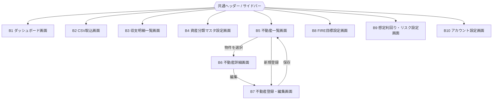

# 画面一覧・画面遷移図

## 1. 位置付け

本ドキュメントは [FIRE-FIRE 要件定義書](./fire-asset-management-requirements.md) および [ログイン画面・認証機能 要件定義書](./auth-login-requirements.md) をもとに、画面一覧と画面遷移図を整理したものである。

対象スコープは Phase 1〜4(認証、CSV取込、資産ダッシュボード、不動産管理、FIRE目標設定)とし、Phase 5(マネーフォワード定期自動取得、SaaS化)に関連する画面は対象外とする。

アプリ全体は、ログイン後は共通ヘッダー/サイドバーから各主要画面へ自由に遷移できる「ダッシュボードアプリ型」のナビゲーション構造を想定する。

## 2. 画面一覧

### 2.1 認証系画面

[auth-login-requirements.md](./auth-login-requirements.md) 4章に準拠。各画面の詳細要件は [screen-requirements-auth.md](./screen-requirements-auth.md) を参照。

| 画面ID | 画面名 | 概要 |
|---|---|---|
| A1 | サインアップ画面 | メールアドレス・パスワード入力。パスワードポリシーをリアルタイムでバリデーション表示 |
| A2 | メールアドレス確認待ち画面 | サインアップ直後に表示。確認メール再送導線を含む |
| A3 | 2FA登録画面 | メール確認後に強制表示。QRコード表示、認証アプリの確認コード入力、リカバリーコードの発行・表示 |
| A4 | ログイン画面 | メールアドレス・パスワード入力、「パスワードをお忘れの方」導線 |
| A5 | 2FA検証画面 | 一次認証成功後に表示。認証アプリの確認コード入力、リカバリーコードへの切り替え |
| A6 | パスワードをお忘れの方画面 | メールアドレス入力、リセットメール送信 |
| A7 | パスワード再設定画面 | リセットメールのリンクから遷移。新パスワード入力 |
| A8 | アカウント連携画面 | 既存のパスワードアカウントと同一メールアドレスでGoogleログインした場合に表示。パスワードによる本人確認を経てGoogleアカウントを連携 |

Googleによるソーシャルログイン([auth-login-requirements.md](./auth-login-requirements.md) 3.8)の開始導線は、A1・A4に「Googleで続ける」ボタンとして追加する(新規画面は設けない)。Googleログイン後も2FAは必須のため、A3・A5はメール/パスワード経由と共通の画面を通る。

### 2.2 ダッシュボード・データ管理系画面

各画面の詳細要件は [screen-requirements-dashboard.md](./screen-requirements-dashboard.md) を参照。

| 画面ID | 画面名 | 概要 | 関連要件 |
|---|---|---|---|
| B1 | ダッシュボード画面 | 総資産推移グラフ、分類別内訳(円グラフ)、FIRE達成度ゲージ/到達予測日、収支サマリ(月次収支・費目別支出)を表示するトップ画面。分類軸の切り替えに対応 | 要件定義書 4.3 / 4.4 |
| B2 | CSV取込画面 | マネーフォワードCSV(資産残高推移/入出金明細)のアップロード。取込種別をタブ等で切り替え | 要件定義書 4.2 |
| B3 | 収支明細一覧画面 | 入出金明細CSVから取り込んだ個々の取引データを一覧・検索する画面 | 要件定義書 4.2 / 4.4 |
| B4 | 資産分類マスタ設定画面 | 資産分類軸(総資産・純金融資産・投資性資産等)をユーザーが追加・編集できる設定画面 | 要件定義書 4.3 |

### 2.3 不動産管理系画面

各画面の詳細要件は [screen-requirements-real-estate.md](./screen-requirements-real-estate.md) を参照。

| 画面ID | 画面名 | 概要 | 関連要件 |
|---|---|---|---|
| B5 | 不動産一覧画面 | 登録済み物件の一覧表示 | 要件定義書 4.5 |
| B6 | 不動産詳細画面 | 物件基本情報、時価、ローン残高、賃貸収入/支出、利ざや(時価-ローン残高)の自動計算結果を表示 | 要件定義書 4.5 |
| B7 | 不動産登録・編集画面 | 物件基本情報・時価・ローン残高・賃貸収入/支出の登録・編集フォーム | 要件定義書 4.5 |

### 2.4 FIRE目標・シミュレーション設定系画面

各画面の詳細要件は [screen-requirements-fire-goal.md](./screen-requirements-fire-goal.md) を参照。

| 画面ID | 画面名 | 概要 | 関連要件 |
|---|---|---|---|
| B8 | FIRE目標設定画面 | 目標資産額の直接設定、または年間支出額からの逆算(4%ルール等)を切り替えて設定 | 要件定義書 4.6 |
| B9 | 想定利回り・リスク設定画面 | 資産クラスごとの想定利回り・リスク値・不動産時価等を手動設定。シミュレーション入力と可視化の両方に反映 | 要件定義書 4.7 |

### 2.5 アカウント系画面

各画面の詳細要件は [screen-requirements-account.md](./screen-requirements-account.md) を参照。

| 画面ID | 画面名 | 概要 | 関連要件 |
|---|---|---|---|
| B10 | アカウント設定画面 | パスワード変更、2FA再設定など、ログイン後のアカウント関連設定を行う画面 | auth-login-requirements.md 3章 |

## 3. 画面遷移図

### 3.1 認証フロー

```mermaid
flowchart TD
    Start([未ログイン]) --> Login[A4 ログイン画面]
    Start --> Signup[A1 サインアップ画面]

    Signup --> VerifyWait[A2 メールアドレス確認待ち画面]
    VerifyWait -->|メール内リンクで確認完了| MFASetup[A3 2FA登録画面]
    VerifyWait -->|セッション無し / やり直し| Signup
    MFASetup -->|確認コード検証成功| Dashboard[B1 ダッシュボード画面]

    Login -->|ID/PW認証成功(2FA登録済み)| MFAVerify[A5 2FA検証画面]
    MFAVerify -->|確認コード検証成功| Dashboard
    MFAVerify -->|リカバリーコード検証成功(TOTP解除 → ログインやり直し)| MFASetup
    MFAVerify -->|検証セッション無し(自動)| Login
    MFAVerify -->|検証セッション期限切れ(ログイン画面へ)| Login
    MFAVerify -->|リカバリーコード検証後のログインやり直し失敗(ログイン画面へ)| Login
    Login -->|ID/PW認証成功(メール未確認)| VerifyWait
    Login -->|ID/PW認証成功(2FA未登録)| MFASetup
    Login -->|パスワードを忘れた| Forgot[A6 パスワードをお忘れの方画面]
    Login -->|アカウントをお持ちでない方| Signup
    Forgot -->|メール内リンクで再設定へ| ResetPw[A7 パスワード再設定画面]
    ResetPw -->|再設定完了| Login
```

### 3.2 ソーシャルログイン(Google)フロー

3.1のA1・A4に追加する「Googleで続ける」導線から分岐する部分のみを抜き出したもの。合流先(A3 / A5 / B1)は3.1と同一の画面である。

```mermaid
flowchart TD
    Signup[A1 サインアップ画面] -->|Googleで続ける| Google{{Googleログイン ポップアップ}}
    Login[A4 ログイン画面] -->|Googleで続ける| Google

    Google -->|ポップアップを閉じた / キャンセル(自動)| Back[元の画面に留まる]
    Google -->|新規作成 メールはGoogle側で確認済み(自動)| MFASetup[A3 2FA登録画面]
    Google -->|既存Googleアカウント・2FA未登録(自動)| MFASetup
    Google -->|既存Googleアカウント・2FA登録済み(自動)| MFAVerify[A5 2FA検証画面]
    Google -->|同一メールのパスワードアカウントが既存(自動)| LinkAccount[A8 アカウント連携画面]

    LinkAccount -->|パスワード検証成功・2FA登録済み(自動)| MFAVerify
    LinkAccount -->|パスワード検証成功・2FA未登録・メール確認済み(自動)| MFASetup
    LinkAccount -->|パスワード検証成功・2FA未登録・メール未確認(自動)| VerifyWait[A2 メールアドレス確認待ち画面]
    LinkAccount -->|連携せずにログインへ戻る| Login
    LinkAccount -->|連携セッション無し(自動)| Login

    VerifyWait -->|メール内リンクで確認完了| MFASetup
    MFASetup -->|確認コード検証成功| Dashboard[B1 ダッシュボード画面]
    MFAVerify -->|確認コード検証成功| Dashboard
```

> Googleアカウントの連携は、2FAの検証まで完了してサインインが成立した時点で実行する(2FA登録済みユーザーはパスワード検証だけではサインインが完了しないため)。
>
> ラベルの `(自動)` は3.1と同じく「ユーザーの操作を挟まずに遷移する」ことを指し、認証結果による分岐(パスワード検証成功後の2FA状況による振り分け)と、前提が満たされていない場合のガード(連携セッション無し)の両方に付く。
>
> A8の「2FA未登録・メール未確認」はA2へ戻る分岐で、A4が「メール未確認」を「2FA未登録」より優先するのと揃えている。ただし連携によって `emailVerified` がtrueになるならこの分岐は発生しない(未確証のオープン課題)。
>
> このうち**A8からA4へ戻す**ガードは「連携セッション無し」の1本だけである。A5の「検証セッション期限切れ」に相当する導線はA8には無い — Google資格情報の期限切れは連携の実行時、つまり**サインインが成立した後**に判明するため、A8やA4へ戻さずB1の「Googleアカウント連携の失敗通知」で扱う(下記 [screen-requirements-dashboard.md](./screen-requirements-dashboard.md) B1)。

### 3.3 メイン画面遷移(ログイン後)

共通ヘッダー/サイドバーから、以下の主要画面へは常時アクセス可能とする(相互遷移)。



## 4. 今後の検討事項

- 各画面の詳細ワイヤーフレーム・入力項目定義は別途作成する
- Phase 5(マネーフォワード定期自動取得の設定画面、SaaS化に伴う管理者向け画面等)は本ドキュメントの対象外とし、別途検討する
